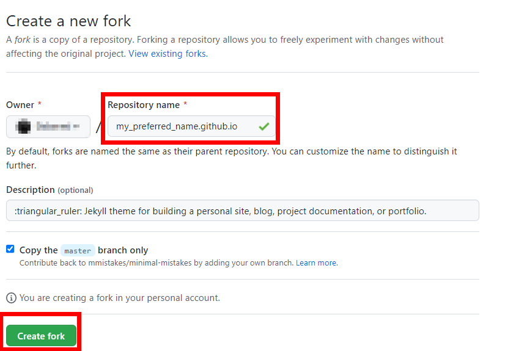

# Summary

I spend some time finding out how to create a GitHub page using a Jekyll theme, my preferred theme is [minimal mistakes](https://mmistakes.github.io/minimal-mistakes/). I did not want to build my blog page locally and then upload it, I prefer only to use [Microsoft Code](https://code.visualstudio.com/) and [GitHub Desktop](https://desktop.github.com/). Spending some time figuring out how I could do that I came across a workaround. Despite there being a ton of useful posts and articles on how to create a page I did not find something to describe it step by step. So I decide my first post to describe how I created [this page](https://0xdroot.github.io)

# Prerequisites

There are some prerequisites before starting to build out the GitHub page. I will mention them briefly,
1. A GitHub account is necessary ;).
2. Installed on our computer the [GitHub Desktop](https://desktop.github.com/) and connect it with our GitHub account
3. Installed on our computer the [Microsoft Code](https://code.visualstudio.com/) and connect it with our GitHub account
4. Basic knowledge of how to use [Markdown](https://www.markdownguide.org/)
5. Using Google ;)

# Workaround

## Fork the Jekyll theme we would like to use

First of all, we fork the project [minimal mistakes](https://github.com/mmistakes/minimal-mistakes) 

After clicking on Fork a new page will load, where we need to rename the repository from *minimal mistakes* with our preferred name of the personal site. The pattern of the new site is 

*domain name*.**github.io**. 

## Configure the GitHub

The next steps are to find the new repository which we created and to go to _Settings_. There is an option for _Pages_ where we have to do some minor changes for our site to be public.

On _Pages_ change the Branch to *Master* and click *Save*.

After 1-2 minutes the personal page has launched and we can start to write posts or to configure the page to suit our preferences.

## Start Posting

Using GitHub Desktop and MS Code we can start posting articles or whatever we want. But before the start, we need to add a folder named *_posts* under the root directory of branch. In this folder, we create the markdown files with the posts. More information on how to use it we can be found in the [minimal mistakes quick guide](https://mmistakes.github.io/minimal-mistakes/docs/quick-start-guide/)

